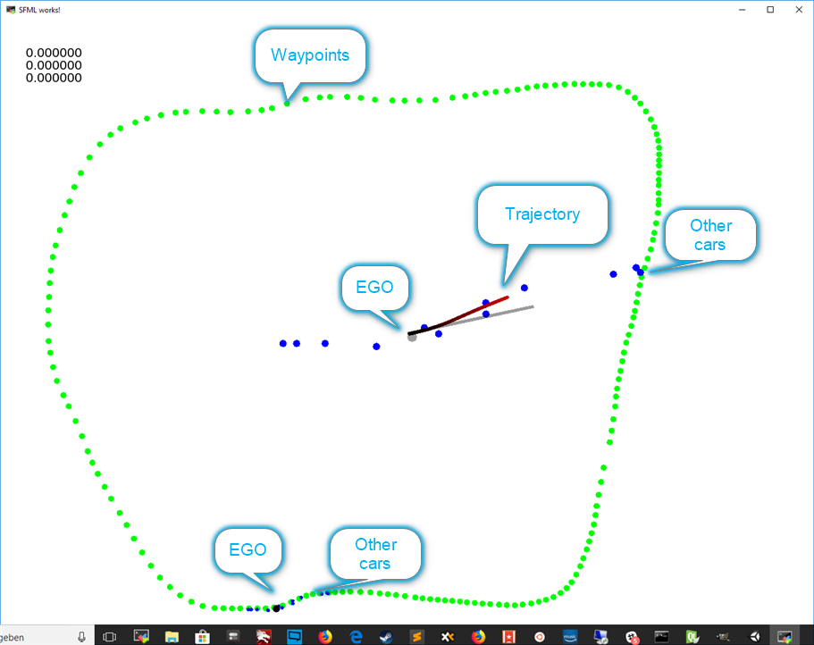

# CarND-Path-Planning-Project
Self-Driving Car Engineer Nanodegree Program


### Goals
In this project your goal is to safely navigate around a virtual highway with other traffic that is driving +-10 MPH of the 50 MPH speed limit. You will be provided the car's localization and sensor fusion data, there is also a sparse map list of waypoints around the highway. The car should try to go as close as possible to the 50 MPH speed limit, which means passing slower traffic when possible, note that other cars will try to change lanes too. The car should avoid hitting other cars at all cost as well as driving inside of the marked road lanes at all times, unless going from one lane to another. The car should be able to make one complete loop around the 6946m highway. Since the car is trying to go 50 MPH, it should take a little over 5 minutes to complete 1 loop. Also the car should not experience total acceleration over 10 m/s^2 and jerk that is greater than 10 m/s^3.


## Basic Build Instructions

1. Clone this repo.
2. Make a build directory: `mkdir build && cd build`
3. Compile: `cmake .. && make`
4. Cd to ../run
4. Run it: `../build/path_planning`.


# Code structure

The structure of the code has been considerably changed to be more modular

## Configuration file

Configuration of many parameters is not done through compiled variables, but through a jason configuration file. The configuration file is stored in run/ directory. That's why the simulator has to be run from that directory, since the current working directory
is being used to look for that file.

```json
{
    "viz" : {
        "w" : 1300,
        "h" : 1000,
        "translate" : {
            "x" : 0.0,
            "y" : -1000.0
        },
        "scale" : 0.45
    },
    "x_debug" : {
        "initial-s" : 2400.0
    },

    "laneWidth" : 4.0,
    "numLanes" : 3,
    "targetSpeed" : 21.01,
    "speedLimit" : 22.352,
    "speedIncrease" : 0.08,
    "speedTolerance" : 0.2,
    "planAhead" : 50.0,
    "sensor" : {
        "range-front" : 100.0,
        "range-back" : 30.0
    },
    "trajectory" : {
        "waypoint-dist" : 30.0,
        "trajectory-length" : 120.0,
        "trajectory-min" : 30.0,
        "reuse-n-points" : 13
    }
}
```

## Code structure

A number of classes has been introduced to make the code more modular:

- vehicle.cpp : Information about vehicles, no matter if ego or other vehicles
- sensor.cpp : Information about the vehicles that can be seen from the car
- trajectory.cpp : Caclulation of the trajectory

- XY : Coordinates, so that we can pass / return one object.

## Path plannning

The path planning is executed in the following steps:

1. Find the fastest / best lane to drive in
2. If best lane is not the current lane, see if lane can be changed safely (no collisions)
3. If (2) results in a lane change, plan new trajectory, otherwise continue on current lane.

### Lane driving / speed determination

To determine the best lane, ```Sensor::fastestLaneFrom(vector<Vehicle> vehicles, int s, lane_type currentLane)``` is invoked. The lines adjacent to the current lane are checked to see if faster driving is possible. The speed of a lane is either
1. our maximum speed (from json file), if there are no cars ahead within sensor range
2. the speed that is possible based on the closest car ahead.

In the case of 2), the speed is not simply the speed of the closest car ahead, because, if the car is far away, we can drive faster for some time until we are within a safe breaking distance.

### Safe Breaking distance

The safe breaking distance determines the speed possible on a line behing the closest car ahead, it is being used both in determining the fastest lane as well as the current speed. The calculation of a safe speed is being done on rough rules, to be found on Wikipedia. A detailed calculation would involve too many unknown parameters. 

The general rule is, that our car should drive in a way, that even if the car ahead does an emergency break, the ego car could still do a regular breaking manouver.  That is, our car should be able to conveniently break in 
```distance to car head + emergency breaking distance of car ahead ```

This distance can be used to calculate the ego speed / speed of a lane with cars ahead in```Sensor::laneSpeed(vector<Vehicle> vehicles, int lane, int s)```

```cpp
        auto break_dist = std::pow((*vehic).speed*3.6,2)/200;
        break_dist = break_dist = (*vehic).s - s ;
        auto v = std::sqrt(break_dist*100)/3.6;
        return std::min(v,Config::getInstance()->targetSpeed());
```

### Determination of optimum lane

In ```Sensor::fastestLaneFrom(vector<Vehicle> vehicles, int s, lane_type currentLane) ``` we check, in order
1. If we can drive with the same speed on the lane right to ego (this is for fun, and to simulate the "Rechtsfahrgebot" in Germany)
2. If we can drive faster on the lane left from ego
3. If we can drive even faster on the lane right from ego

This will result in a behaviour that will prefer overtaking on the left, but will overtake on the right if faster.

### Collision checking

To check, if lanes can be changed safely, we see if that would cause a collision within a certain time frame. Collision time based on speeds and position is in
```cpp
std::pair<double,double> Vehicle::collision_range (const Vehicle &other) const  {
    return coll_range(s,speed,other.s,other.speed,Config::getInstance()->collisionBuffer());
}

// |s0+v0t-s1-v1t| <= car_len
// -car_len <= s0+v0-s1-v1 <= car_len
// d = s0-s1
// -car_len <= d+(v0-v1)t <= car_len
// -car_len-d >= (v0-v1)t >= car_len -d
//
inline std::pair<double,double> coll_range(double s0, double v0, double s1, double v1, double car_len) {
    auto d = s0-s1;

    auto l = (-car_len-d)/(v0-v1);
    auto r = (car_len-d)/(v0-v1);
    return std::pair<double,double> (std::min(l,r),std::max(l,r));

}
```

The segment in ```main.cpp``` that combines this logic is

```cpp
            auto fastestLane = front_sensor.bestLaneFrom(*vehicles,ego.s,ego.lane);

            // If we have a lange change, calculate if we would have a
            // collision with one of the other cars.
            //
            if(fastestLane != ego.lane) {
                std::vector<Vehicle> dest_lane_vehic ;
                std::copy_if(vehicles->begin(),vehicles->end(),back_inserter(dest_lane_vehic),
                             [fastestLane](const Vehicle &it) {return it.lane == fastestLane;});

                std::vector<double> coll_times;
                std::transform(dest_lane_vehic.begin(),dest_lane_vehic.end(),back_inserter(coll_times),
                               [ego](const Vehicle &it) {return it.collision_time(ego);});

                for(auto t : coll_times) {
                    cout << "Coll " << t << endl;
                    if( t >= 0.0 && t <= 10.0) {
                        cout << "Not overtaking" << endl;
                        fastestLane = ego.lane;
                    }
                }
            }
``` 
### Trajectory Planning

If we keep the same lane, we proceed with a trajectory based on increasing s (according to a target speed). Otherwise, a lane change trajectory is planned (changing lane within 120m):

```cpp
            if(fastestLane == ego.lane)
            {
                // The number of points that we caclulate depends on
                // the distance we want to look ahead and the
                // distance of the waypoints. It does not make sense
                // to use more fine grained waypoints, since the getXY function is limited
                //
                auto count = Config::getInstance()->trajectoryTrajectoryLength()/Config::getInstance()->trajectoryWaypointDist();
                for(int i = 1; i<count;i++) {
                    // We are pushing the points on the track that we want to hit!
                    sd_list.push_back(Sd(replanFrom+Config::getInstance()->trajectoryWaypointDist()*i,lane2d(ego.lane)));
                }
            } else
            {
                double cur_d = 0.0;
                double dest_d = 0.0;

                cur_d = lane2d(ego.lane);
                dest_d = lane2d(fastestLane);

//                sd_list.push_back(Sd(replanFrom+0,cur_d));
                sd_list.push_back(Sd(replanFrom+30.0,cur_d));
                sd_list.push_back(Sd(replanFrom+60,(cur_d+dest_d)/2 ));
                sd_list.push_back(Sd(replanFrom+90,dest_d ));
                sd_list.push_back(Sd(replanFrom+120,dest_d ));
            }
```

### Trajectory Caclulation

As in the walk-through, splines are being used for calculation of the trajectory. The trajectory points are being filled from the spline defined in the previous step in ```Trajectory::fillLists(std::vector<XY> &out, double initialSpeed, double targetSpeed, double startX)```

Note that, in contrast on the walkthrough, this code uses distance calculation a long the actual curve of the spline (the walkthrough uses the x-axis, which is imprecise).

The code is as follows
```cpp
    while(xPos < pImpl->max_x) { // repeat until we have reached the last of the points that we actually passed
        auto diffSpeed = targetSpeed - curSpeed;
//        std::cout << "xPos cur /diff " << xPos << " " << curSpeed << " " << diffSpeed << std::endl;
        if(fabs(diffSpeed) > Config::getInstance()->speedTolerance()) {
            curSpeed += copysign(Config::getInstance()->speedIncrease() , diffSpeed);
        }
//        std::cout << "distperditck " << curSpeed << " " << dist_per_tick(curSpeed) << std::endl;
        xPos = nextPointWithDistance(xPos, dist_per_tick(curSpeed));
        out.push_back(XY(xPos,pImpl->s(xPos)));
    }
```
1. See if we already reached the target speed
2. If not, then change the speed according to the increase in the config file (0.08)
3. See the distance that we could cover with that speed within one tick (```dist_per_tick(curSpeed)```)
4. Determine the correct point along the spline and push that.

## Tying it altogether

The code steers the car without collision at a speed of 46-47 mph. The following design decisions have been made:

1. The control strategy and logic is based on if statements etc. No cost functions have been used (similar to walkthrough). This is for several reasons:
- code is more predictable, good for safety
- simulator cannot be set to defined situations, makes it very difficult to reproduce / test complex algorithms

2. The state machine is implicit, in the steps of the code.

## Additional Visualization

For analysis and visualization, if the code is compiled with DEBUG options and a customized CMakefile, it will create additional output both on the console, as well as a animated analysis:



